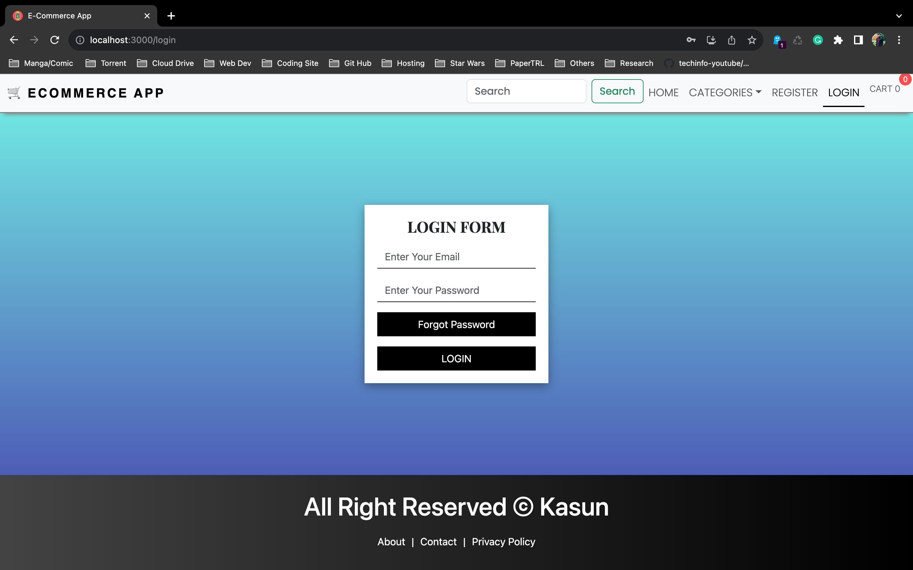
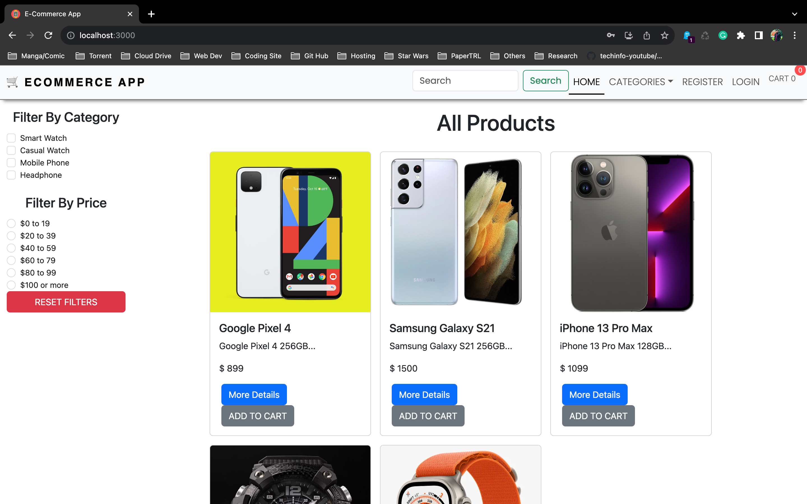
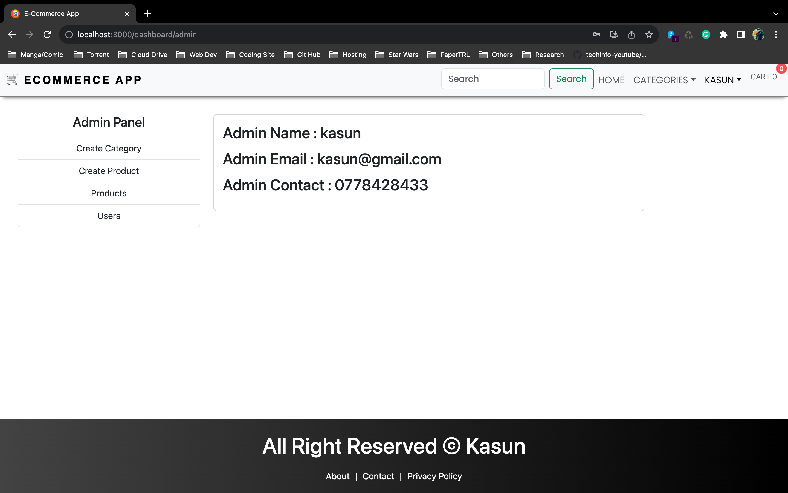
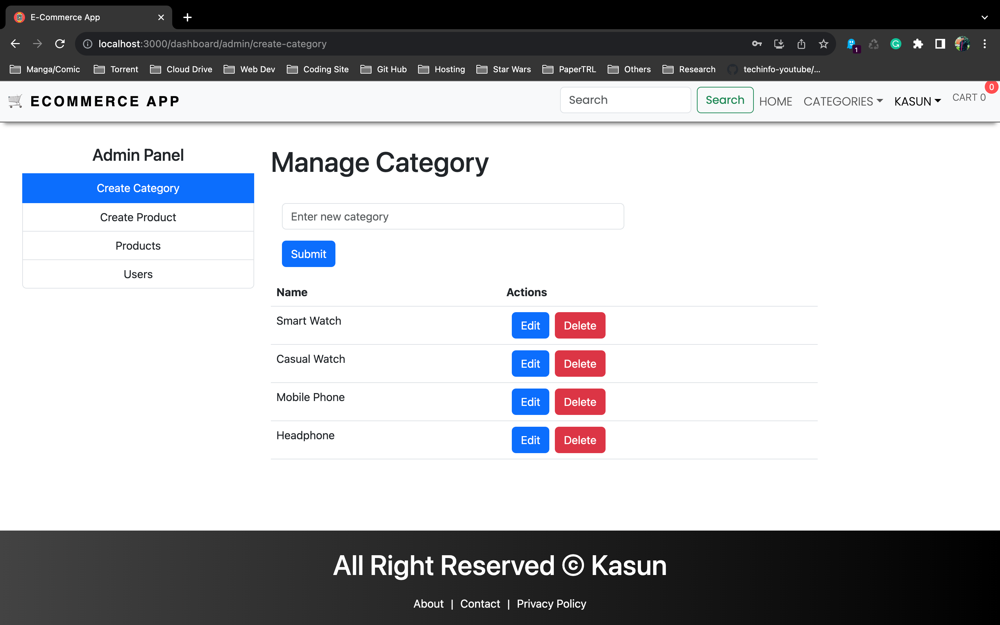
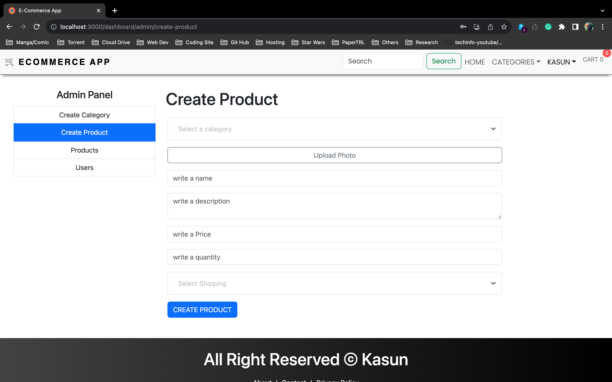
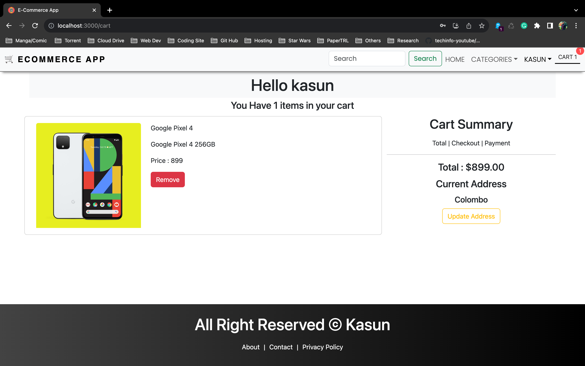

# E-Commerce Web Site.

---

### Description.

#### Users can register using their email and password and buy the product. also, users can forget their passwords. and Admin can add categories, add products, delete products, and update products.

### This website is Optimized to Provide for All Mobile & Desktop Devices you Can View.

---

### Languages & Tools

* HTML
* CSS
* JavaScript
* MongoDB
* Express
* React
* Node
* Intellij IDEA
---

# Website View.

### Login Form

### Home Page

### Admin Credentials

### Admin Add Category

### Admin Add Products

### Cart
